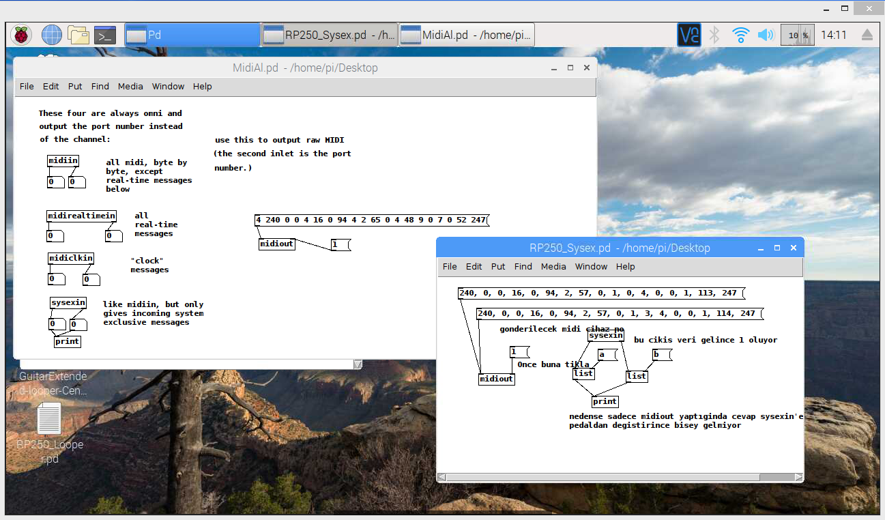

# PocketPOD
(Related PD Patch is PocketPOD.pd, RoboRemo remote control GUI is PocketPODMain.txt)

Raspberry Pi Guitar Pedal Controller via PD (Pure Data) and MIDI. Supports Line6 Pocket POD and Digitech RP250

I have developed two different Pure Data program to control Line6 Pocket POD and Digitech RP250 multi effects pedal. But it can be applied to any MIDI enabled guitar pedals, effect processors or other instruments like keyboards or synthesizers.
My plan is to combine each program together and control both of my multi effects pedal together, therefore I put both programs here. 

Currently both program runs on Raspberry Pi Zero W. It is also working on Raspberry Pi Model B and I have built a pedal board with buttons, LEDs and potentiometers to control multieffect processors.

Target:
-------
1. Remotely control my Line6 Pocket POD and Digitech RP250 multi effects pedals via WiFi or Bluetooth.
2. To make available some functions of multi effects pedals via GUI or physical interface. For example Pocket POD has built in Wah Wah effect however there is no effect pedal connection to this device. You may find the interface details for each effect pedal below.
3. To make available all function in a single GUI. Pocket POD is a beautiful small device, but it has limited buttons and potentiometers on it. Therefore you cannot edit all functions easily, you have to dig in menus. Instead of this, you may see and control all parameters on a GUI. 

**An image from part of PD patch PocketPOD.pd**

**RoboRemo GUI on Android Phone**

Video:
------
You may see Pocket POD control videos from below links:

Demo with Pocket POD connected to Raspberry Pi.
https://youtu.be/U2I2CBarQQ8

PD & MIDI Configuration.
https://youtu.be/n9fUughpuog

Sending commands to Pocket POD using PD Patch. You may use VNC to connect remotely to Raspberry Pi Zero W. Therefore this full GUI also works over WiFi.
https://youtu.be/KgRP33Cb9XA

Remote connection using WiFi & Cell phone. Connection with RoboRemo application.
https://youtu.be/Mi8RPiiXM-o

Below are the functions that are tested and working.

Line6 Pocket POD Program Functions:
------------------------------------

**About this device:** Pedal uses MIDI Control commands to change presets etc. So if you know the control commands it is straightforward to control it with Pure Data.

**Program functions:**
1. Pure Data GUI developed to control all functions of the pedal on single screen.
2. Can read input from Raspberry Pi GPIO pins and Potentiometers (ADC MCP3008) and drive LEDs accordingly. You can change presets, volume, drive level, effects level etc. using this hardwired interface.
3. Can get input remotely from cell phone using RoboRemo android program. (https://www.roboremo.com/ Thanks to RoboRemo developer, it is a really handy application for any kind of direct control over WiFi or Bluetooth)
4. Using RoboRemo, you can tie cell phone motion sensors to any effect. For example in my program, mobile phone X direction sensor connected to Wah Wah effect. Shake your phone and get Wah Wah effect :).

**What help I need to develop:**
1. I wrote over 100 preset names by hand under [pd PresetNames]. It will be good to read these preset names from the device.
2. If presets changed it will be good to write new presets to the device as it works with its own PC program Vyzex.
I believe both of these functions can be done with MIDI SysEX (Sytem Exclusive) messages.

Digitech RP250 Program Functions:
----------------------------------

**About this device:** 
1. Pedal uses MIDI SysEX (System Exclusive) to change presets etc. So if you know the control commands it is straightforward to control it with Pure Data.
2. Most interestingly, any computer or Raspberry Pi can identify this device as a MIDI device and a Sound Card over USB. BOTH interfaces TOGETHER! So it makes possible to control device with MIDI and record guitar sound together. I succesfully recorded guitar sound using Pure Data and I am currently trying to make a Looper patch.
3. RP250 is fantastic as a USB Soundcard! It works in both ways, you can either record sound over USB or send sound to RP250 and listen through the connected amplifier. Therefore I have used Pure Data [readsf~] and [dac~] functions to playback pre recorded voice messages like "preset changed", "remote user connected" etc.

**Program functions:**
I have developped two program for RP250 and I will combine them together.

**Program A (RP250_Looper.pd)**
1. Pure Data running on Raspberry Pi connected to my hardwired interface. (DIY Pedal board interface, 10 buttons and LEDs, 7 onboard + 1 pedal potentiometers).
2. Still developing Looper function in this part. I have discovered how to make a clickless looper with the help of another project. (https://guitarextended.wordpress.com/2013/08/05/making-a-looper-with-pure-data/) Thanks to its developer! It is a great information about how PD records sound and it is also a briliant description why PD made some clickes while overdubbing.

**Program B (RP250_Sysex.pd)**
1. It can change presets via with Pure Data using MIDI SysEX messages. I have used very valuable information from Gdigi project (https://desowin.org/gdigi/). Again, thanks to its developer!
It is only changing between two presets at the moment. I do not know C, therefore instead of examining desowin's gdigi program, I plan to sniff communication to identify other MIDI SysEx messages.

